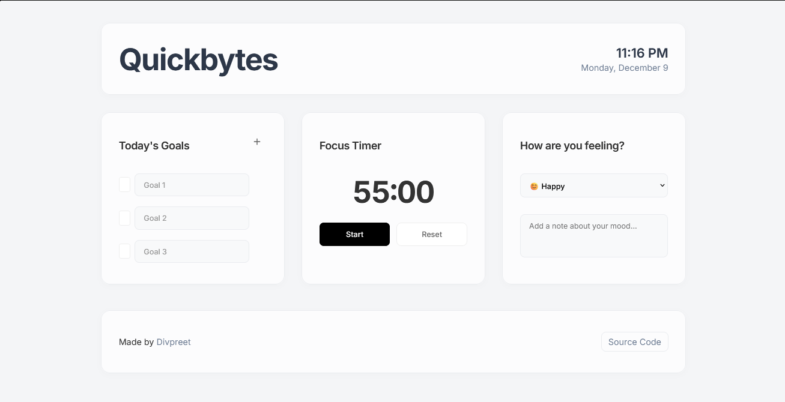

# Quickbytes

A minimalist productivity dashboard built with Svelte, featuring daily goals tracking, focus timer, and mood tracking capabilities.

## Features

- **Daily Goals Tracker**: Create, manage, and track your daily goals with a clean interface
- **Focus Timer**: Built-in Pomodoro-style timer for productive work sessions
- **Mood Check**: Track your daily mood and add notes about your emotional state
- **Persistent Storage**: All data is saved locally in your browser
- **Responsive Design**: Works seamlessly across all devices
- **Smooth Animations**: Polished user experience with subtle transitions

## Tech Stack

- Svelte
- Local Storage API
- BoxIcons
- Inter Font Family
